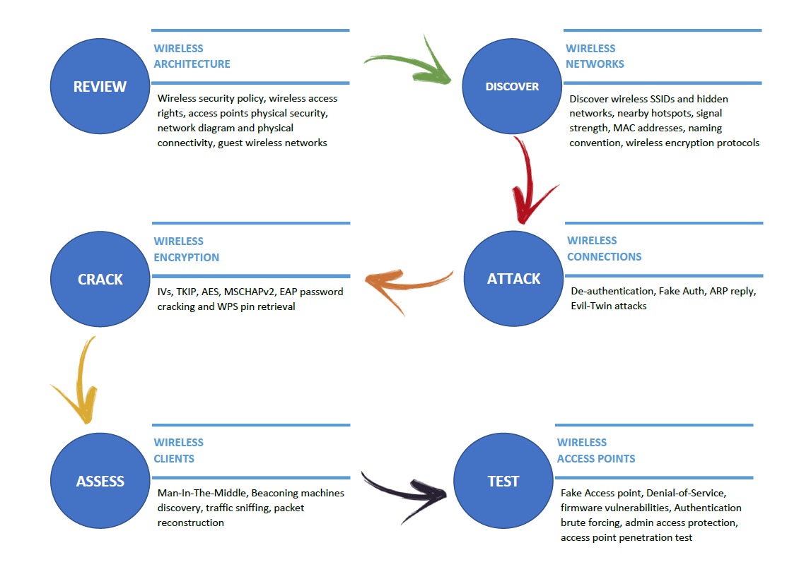
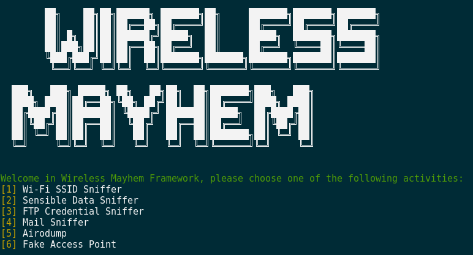
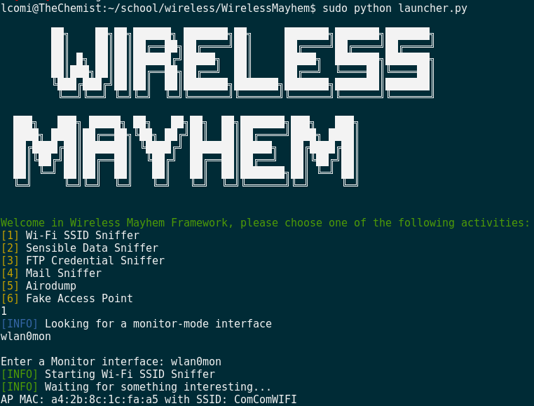
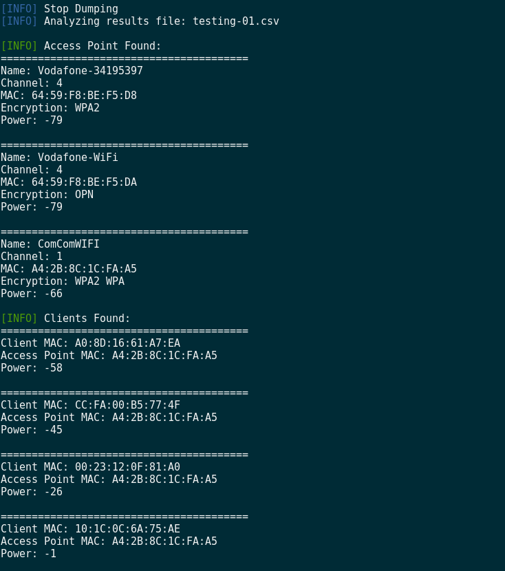

## Project Description
This tool was developed as the final project of the "Wireless Network" course @ Università degli Studi di Milano.
Our professor asked us to develop something interesting, innovative and creative regarding wireless technologies that we have studied during his coursework. 
I decided to create a small framework that will automate some of the tipical phases of the procedure that penetration testers or security experts have to perform in order to make a correct wireless network assessment.
## Technical Details
Wireless Mayhem is a python framework developed to automate wireless discovery and exploitation.
### Main Features
- Sniffing tools
- Fake Access Point based attacks
- Modular and scalable approach
- Easy to custom
### What can I do with Wireless Mayhem Framework (WMF)
Thanks to Wireless Mayhem Framewoork you can automate some steps of the wireless assessment procedure:


- **DISCOVER**: the WMF integration with airodump-ng can find out any Wireless network that is near you and provide a user friendly output in order to speed up the reconnaissance and discovery phases.
- **ATTACK & CRACK**: WMF implements a Fake AP using the hostapd-wpe software which, for example, is able to simulate a PEAP-WPA Enterprise network Access Point and intercept passwords hashes; it can be also configured to instantiate a simple fake AP useful for many other attacks.
- **ASSESS**: WMF actually provides three different sniffer filters based on regular expressions and python's scapy library; with this configuration you only have to choose what you want to sniff and then launch the tool. 

### Architecture


### Hardware
Based on my personal experience with wifi penetration testing, I suggest you buying this external wifi antenna: 
- http://www.tp-link.it/products/details/cat-11_TL-WN722N.html

However any kynd of wireless network adapter, if capable of packet injection, should work well, just check the compatibilty list here:
- https://www.aircrack-ng.org/doku.php?id=compatible_cards

## WMF Setup (on Debian)

### Dependencies

- **Hostapd-wpe** (https://github.com/OpenSecurityResearch/hostapd-wpe)

Building instruction from the official repository:

```
$ git clone https://github.com/OpenSecurityResearch/hostapd-wpe

Ubuntu/Debian/Kali Building:

$ apt-get update
$ apt-get install libssl-dev libnl-dev

If you're using Kali 2.0 install:

$ apt-get install libssl-dev libnl-genl-3-dev

Now apply the hostapd-wpe.patch:

$ git clone https://github.com/OpenSecurityResearch/hostapd-wpe
$ wget http://hostap.epitest.fi/releases/hostapd-2.6.tar.gz
$ tar -zxf hostapd-2.6.tar.gz
$ cd hostapd-2.6
$ patch -p1 < ../hostapd-wpe/hostapd-wpe.patch
$ cd hostapd

If you're using Kali 2.0 edit .config file and uncomment:
CONFIG_LIBNL32=y

$ make

I copied the certs directory and scripts from FreeRADIUS to ease that portion of things.
You should just be able to:

$ cd ../../hostapd-wpe/certs
$ ./bootstrap

Then finally just:

$ cd ../../hostapd-2.6/hostapd
$ sudo ./hostapd-wpe hostapd-wpe.conf
```

- **Python-Scapy** (http://www.secdev.org/projects/scapy/)
```
$ pip install scapy
```

- **Aircrack-ng suite** (https://www.aircrack-ng.org/)
```
$ sudo apt-get install aircrack-ng
```

- **FreeRadius-WPE** (https://github.com/brad-anton/freeradius-wpe)

### Clone and Launch

After downloading and installing all the dependencies:
```
$ git clone https://github.com/c0mix/WirelessMayhem.git
$ cd WirelessMayhem
$ sudo python launcher.py
```

### Deploy New Module
If you want to create your custom module you simple need to put all your stuff and code into a separte python file, import it into the laucher.py one and add an entry into the "loop-menu".

- Create example.py file and put it into the Wireless Mayhem folder.
- Import your module inside laucher.py adding the following line
```
  import example.py
```
- Add an entry inside the menu for calling your module:
```
  elif input == '6':
    print G + '[INFO]' + W + ' Starting Fake Access Point'
         [...]
  elif input == '7':
    print G + '[INFO]' + W + ' Starting example'
         [...]
```
## Final Presentation Slide

[Wi-Fi_Mayhem_Slide.pdf](Wi-Fi_Mayhem_Slide.pdf)


## Screenshots & Video Demo
### Main Menu


### Access Point Discovery


### Discovery Output


### VIDEO Sniffing FTP Credentials
[](https://www.youtube.com/watch?v=KcH81PO7jVk)

### VIDEO Fake Access Point to Steal User Credentials 
[](https://youtu.be/IWd2DJfDrPo)
